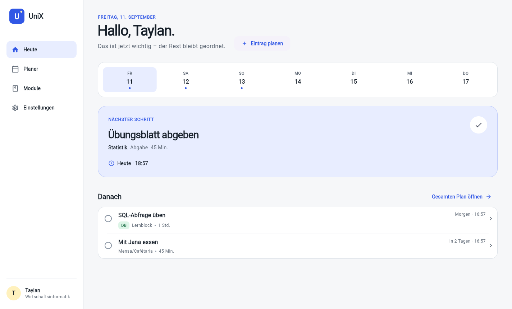

# UniX

UniX ist eine moderne Studienplanung für Windows und die spätere iOS-App. Der erste belastbare Produktkern verbindet persönliche Ersteinrichtung, Module, Prüfungen, Abgaben, Lernblöcke, Organisation und Mensa/Cafétaria mit einer klar priorisierten Tagesansicht.

CampusGig, Marketplace, StudyMatch und SemesterMate sind bewusst noch nicht als Attrappen eingebaut. Sie folgen erst in eigenen, fachlich und sicherheitstechnisch geprüften Meilensteinen.



## Direkt verwenden

1. `UniX-0.5.0-Setup.exe` aus dem [GitHub-Release](https://github.com/tayco00/UniX/releases) herunterladen.
2. Installer öffnen und Zielordner wählen.
3. UniX über die erstellte Desktop- oder Startmenü-Verknüpfung starten.

Der aktuelle öffentliche Build ist noch nicht mit einem kostenpflichtigen Windows-Code-Signing-Zertifikat signiert. Windows kann deshalb einen SmartScreen-Hinweis anzeigen. Vor der Ausführung lässt sich die veröffentlichte SHA-256-Prüfsumme vergleichen.

## Projekt einrichten

Voraussetzung ist Node.js 22 oder neuer. Danach genügt unter Windows im Projektordner:

```powershell
.\scripts\setup.ps1
```

Alternativ kann `Setup UniX.cmd` doppelt angeklickt werden. Das Setup lädt Flutter 3.47.3 in den benachbarten Ordner `Ideen\.tooling`, installiert exakt gesperrte npm-Pakete, löst Dart-Pakete auf und erzeugt die App-Icons. Die portable Flutter-Installation bleibt außerhalb des Git-Repositories.

## Start und Stop

Nach einem Paket-Build:

```powershell
.\Start UniX.cmd
.\Stop UniX.cmd
```

`Start UniX.cmd` öffnet ausschließlich `release\win-unpacked\UniX.exe`. `Stop UniX.cmd` beendet ausschließlich genau diesen Build und kann gefahrlos erneut ausgeführt werden. Bei ungespeicherten Eingaben fragt UniX nach; eine laufende Speicherung wird vor dem Beenden abgewartet.

Für eine Desktop-Verknüpfung:

```powershell
.\scripts\create-desktop-shortcut.ps1
```

Während der Entwicklung startet `npm run dev` Flutter und den Desktop-Host gemeinsam. Beenden erfolgt dort mit `Strg+C` im Terminal.

## Qualität und Tests

```powershell
npm run format:check
npm run analyze
npm run test:dart
npm run test:host
npm run test:product
npm run test:desktop
npm run audit
npm run quality
```

`npm run test:dart` verwendet kurzzeitig einen pfadneutralen Laufwerksalias. Das umgeht einen Fehler des Flutter-Teststarters bei Apostrophen im ausdrücklich gewünschten Projektpfad; der Alias wird nach dem Lauf immer entfernt.

Die interne Abnahme umfasst 156 konkrete Kriterien in 13 Kategorien. Sie stehen in [docs/acceptance-criteria.md](docs/acceptance-criteria.md). `npm run quality` wird erst grün, wenn alle Nachweise erbracht und die Kriterien als erfüllt dokumentiert sind.

## Build

Flutter-Produktionsoberfläche und entpackte Windows-App:

```powershell
npm run build:flutter
npm run pack
```

Installer:

```powershell
npm run build
```

Ergebnisse:

- `release\win-unpacked\UniX.exe` – direkt startbare Anwendung
- `release\UniX-0.5.0-Setup.exe` – Windows-Installer

Der native Flutter-Windows-Runner liegt bereits unter `windows/`. Für seinen Build fehlen auf dem aktuellen Rechner die Visual-Studio-C++-Werkzeuge. Deshalb kapselt Version 0.5.0 denselben Flutter-Produktionsbuild in einem kleinen, gehärteten Electron-Host. Produktlogik und UI bleiben vollständig in Flutter/Dart und damit für iOS wiederverwendbar.

Ein iOS-Build benötigt später macOS, Xcode, ein Apple-Entwicklerkonto sowie Signing. Der vorbereitete Runner liegt unter `ios/`.

## Architektur

- Flutter/Dart: gemeinsame Produktlogik, UI und Tests für Windows und später iOS
- Repository-Vertrag: austauschbare Datenhaltung ohne Kopplung der Fachlogik
- versioniertes JSON-Schema: validierbare Sicherung und spätere Migration
- Local-First: der Produktbetrieb benötigt keine externe API; eine spätere Synchronisierung wird als eigener Kontext ergänzt
- Electron: vorübergehende Windows-Auslieferungshülle ohne Produktregeln
- Ruflo: nur projektbezogene Entwicklungsregeln, keine Produkt- oder Release-Abhängigkeit

Entscheidungen und Grenzen sind in [Produktauftrag](docs/product-charter.md), [Stakeholderregister](docs/stakeholders.md), [Architektur](docs/architecture.md) und [Designsystem](docs/design-system.md) festgehalten.

## Daten und Wiederherstellung

UniX verwendet das neue Schema `1` und den neuen Schlüssel `app.unix.workspace.v1`. Daten früherer Versionen werden weder gelesen noch überschrieben. Unter Einstellungen kann eine vollständige JSON-Sicherung exportiert, vor dem Import vollständig validiert und nach Bestätigung wiederhergestellt werden.

## Roadmap

- M0: Projektneustart, Produktauftrag, Stakeholder, Architektur und Designsystem
- M1: verlässlicher Planungskern und Windows-Pilot
- M2: Nutzerpilot, Accessibility-Audit, nativer Windows-Build und iOS/TestFlight
- M3: CampusGig nach Identitäts-, Moderations- und Haftungskonzept
- M4: Marketplace auf derselben Vertrauensbasis
- M5: StudyMatch mit Matching- und Sicherheitskonzept
- M6: SemesterMate, Kalender und Synchronisierung bei Bedarf

Die vollständigen Gates stehen in [docs/roadmap.md](docs/roadmap.md).
