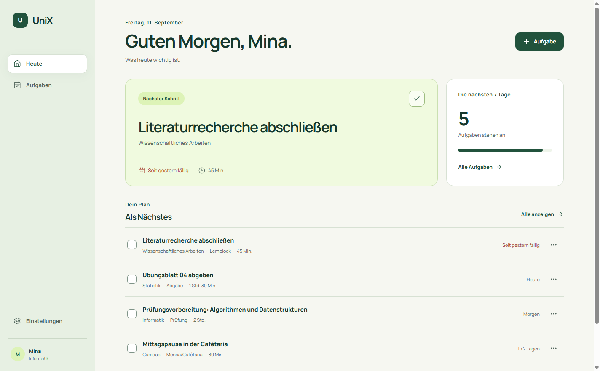

# UniX

UniX ist eine Windows-Desktopanwendung, die Aufgaben, Fristen und Lernzeiten in einer ruhigen Studienübersicht bündelt. Der erste Meilenstein konzentriert sich bewusst auf einen verlässlichen Studienplaner. CampusGig, Marketplace, StudyMatch und SemesterMate folgen erst nach eigenen Produkt- und Sicherheitsprüfungen.



## Aktueller Funktionsumfang

- kurze Ersteinrichtung mit Vorname, Hochschule, Studiengang und Semester (optional)
- Tagesansicht mit genau einer hervorgehobenen nächsten Aufgabe
- Aufgaben anlegen, bearbeiten, löschen, erledigen und wieder öffnen
- Arten Prüfung, Abgabe, Lernblock, Organisation und Mensa/Cafétaria
- verständliche Fälligkeiten, Prioritäten und Zeitschätzungen
- Filter für offene, alle und erledigte Aufgaben sowie Volltextsuche
- Profil bearbeiten, Sicherung exportieren, Sicherung wiederherstellen und neu beginnen
- verständliche Leer-, Lade-, Fehler-, Speicher- und Wiederherstellungszustände
- Übernahme des bisherigen UniX-Datenformats

Nicht enthalten sind Accounts, öffentliche Profile, Nachrichten, Zahlungen, CampusGig, Marketplace, StudyMatch, Kalender-Synchronisierung oder Cloud-Dienste. Diese Funktionen werden in späteren Meilensteinen nicht nur ergänzt, sondern jeweils vorab fachlich und sicherheitstechnisch validiert.

## UniX verwenden

### Installer

1. `UniX-0.4.0-Setup.exe` aus dem aktuellen GitHub-Release herunterladen.
2. Installer öffnen und den Schritten folgen.
3. UniX über die Desktop- oder Startmenü-Verknüpfung starten.

Der Installer ist noch nicht digital signiert. Windows kann deshalb einen SmartScreen-Hinweis anzeigen. Die veröffentlichte SHA-256-Prüfsumme erlaubt eine Integritätsprüfung.

### Direkt aus diesem Projektordner

Nach einem Build startet ein Doppelklick auf `Start UniX.cmd` die Anwendung. `Stop UniX.cmd` beendet ausschließlich diese Projektversion regulär und wartet auf laufende Speichervorgänge. Das normale Schließen des Fensters funktioniert ebenfalls.

## Entwicklung einrichten

Voraussetzungen: Windows 10 oder 11, Node.js 22 oder neuer und npm.

Ein frischer Checkout benötigt genau diesen Installationsbefehl:

```powershell
npm ci
```

Entwicklungsmodus starten:

```powershell
npm run dev
```

Mit `Ctrl+C` im geöffneten Terminal wird der Entwicklungsmodus beendet.

## Tests und Qualitätsprüfung

```powershell
npm run quality
```

Der Befehl prüft TypeScript, Code-Regeln, automatisierte Tests und alle 120 internen Abnahmekriterien. Ergänzend stehen echte Desktop-Abläufe zur Verfügung:

```powershell
npm run build:web
npm run test:desktop
```

Nach einem Paket-Build prüft derselbe Ablauf die gebaute Windows-Anwendung:

```powershell
npm run test:packaged
```

Die Desktop-Prüfung arbeitet in einem isolierten Testordner. Sie verändert keine persönlichen UniX-Daten.

## Windows-Build

Entpackte, direkt startbare Anwendung erzeugen:

```powershell
npm run pack
```

Installer erzeugen:

```powershell
npm run build
```

Ergebnisse:

- `release/win-unpacked/UniX.exe`
- `release/UniX-0.4.0-Setup.exe`

Node.js und Ruflo werden auf dem Ziel-PC nicht benötigt.

## Daten und Sicherungen

UniX speichert ein versioniertes Datenmodell im Windows-Anwendungsdatenverzeichnis. Schreibvorgänge sind serialisiert und atomar; vor dem Überschreiben entsteht eine automatische Sicherung. Zusätzlich kann in den Einstellungen eine frei wählbare JSON-Sicherung exportiert und später wiederhergestellt werden.

Altdaten aus UniX Version 1 werden beim Lesen in Version 2 überführt. App-ID und Windows-Datenverzeichnis wurden dafür beibehalten.

## Technik

- Electron für den eigenständigen Windows-Prozess und das Packaging
- React und TypeScript für eine wartbare, testbare UI
- Vite für schnelle Entwicklungs- und Produktions-Builds
- Zod für die Validierung an Daten- und Importgrenzen
- Electron Builder für entpackte Builds und den NSIS-Installer

Die UI, Domänenlogik, Speichergrenze und Desktop-Brücke sind getrennt. Dadurch kann das aktuelle Dateirepository später gegen SQLite oder einen Synchronisierungsadapter ausgetauscht werden, ohne die Fachlogik neu zu schreiben. Mobile Clients können das Domänenmodell und die API-Verträge übernehmen, während die Electron-Hülle Windows-spezifisch bleibt.

Ruflo 3.41.2 ist ausschließlich als projektbezogener Entwicklungs- und Prüfharness eingerichtet. Die Anwendung hängt zur Laufzeit nicht davon ab.

## Dokumentation

- [120 Abnahmekriterien](docs/acceptance-criteria.md)
- [Architekturentscheidung](docs/architecture.md)
- [Gestaltungsgrundlagen](docs/design.md)
- [Prüfprotokoll](docs/verification.md)
- [Meilensteine und Roadmap](docs/roadmap.md)

## Roadmap

| Meilenstein | Inhalt | Status |
| --- | --- | --- |
| M0 | Neustart, Feedbackvertrag und Ruflo-Integration | abgeschlossen |
| M1 | Studienplaner, Windows-App, Datenmigration und Release | abgeschlossen |
| M2 | CampusGig mit Verifikation und Moderation | geplant |
| M3 | Marketplace auf derselben Vertrauensbasis | geplant |
| M4 | StudyMatch | geplant |
| M5 | SemesterMate, Synchronisierung und mobile Clients | geplant |

Details und Gates stehen in [docs/roadmap.md](docs/roadmap.md).
